# Evidencias · Laboratorio API Gateway

## Integrantes
- Nombre:Maximiliano Diaz
- Nombre:Rodrigo Cruz
- Nombre:Felipe Farias
- Nombre:Mario Jaramillo

## 1. Backend directo

Antes de utilizar el gateway, registrar las pruebas directas contra JSONPlaceholder.

| Método | URL | Status | Observación |
|---|---|---:|---|
| GET | `https://jsonplaceholder.typicode.com/posts` | 200| Se obtiene directamente la colección de posts desde JSONPlaceholder. |

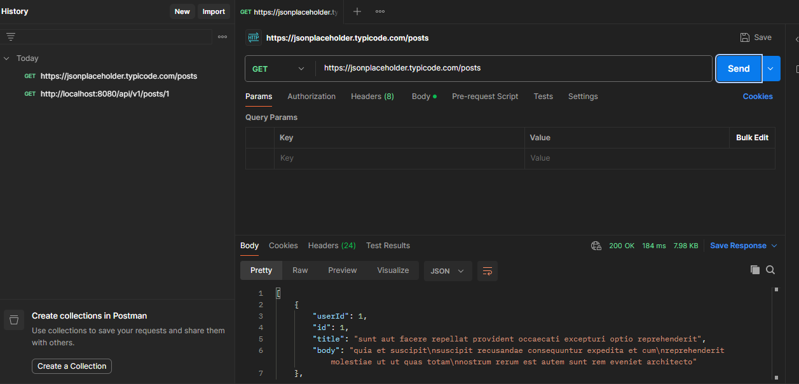

| GET | `https://jsonplaceholder.typicode.com/posts/1` | 200 | Se obtiene directamente el recurso identificado con id 1. |

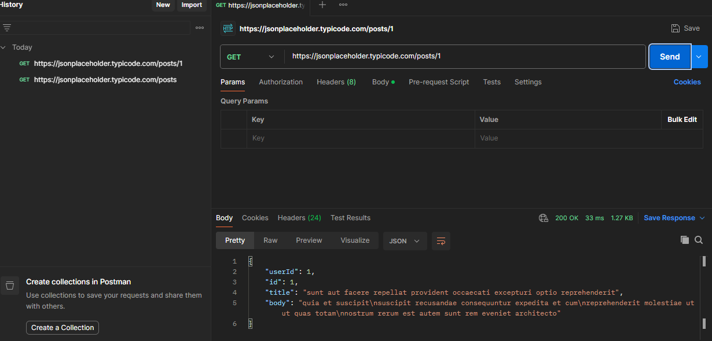

**¿Qué información del backend conoce el cliente en este escenario?**

Respuesta:
**El cliente conoce directamente la dirección del backend https://jsonplaceholder.typicode.com. Esto genera acoplamiento entre el cliente y la ubicación del servicio. Si existieran múltiples servicios o el backend cambiara de ubicación, los clientes tendrían que conocer y actualizar directamente esas direcciones. El API Gateway permite abstraer el backend detrás de un punto de entrada común.**
---

## 2. Arquitectura final

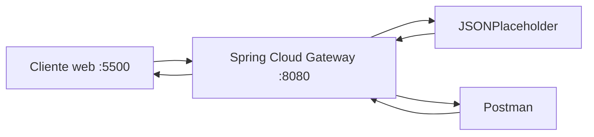
```
Cliente web :5500: Página web que hace las solicitudes y muestra la información recibida. Postman: Herramienta usada para probar las solicitudes y revisar las respuestas. Spring Cloud Gateway :8080: Recibe las solicitudes y las envía al backend correcto. JSONPlaceholder: Servicio que entrega los datos solicitados, por ejemplo los posts.
```
---

## 3. Pruebas HTTP mediante gateway

| Método | URL | Status | Headers relevantes | Interpretación |
|---|---|---:|---|---|
| GET | `/api/v1/posts` | 200 | | colección |

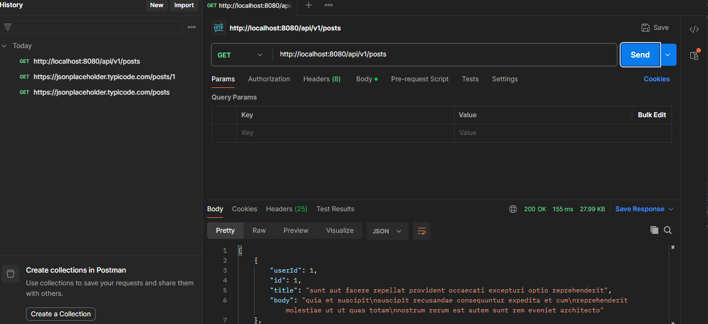

| GET | `/api/v1/posts/1` | 200 | | recurso individual |

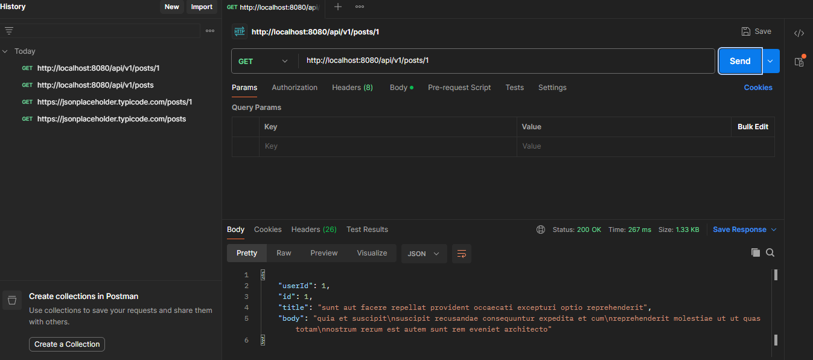

| POST | `/api/v1/posts` | 201 | `Content-Type: application/json` | creación simulada |

### Body enviado en POST

```json
{
  "title": "Cloud Native",
  "body": "Laboratorio API Gateway",
  "userId": 1
}
```

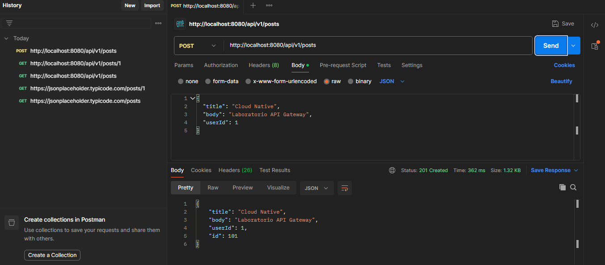


| PUT | `/api/v1/posts/1` | 200| `Content-Type: application/json` | actualización simulada |

### Body enviado en PUT

```json
{
  "id": 1,
  "title": "Cloud Native actualizado",
  "body": "Prueba PUT mediante gateway",
  "userId": 1
}
```
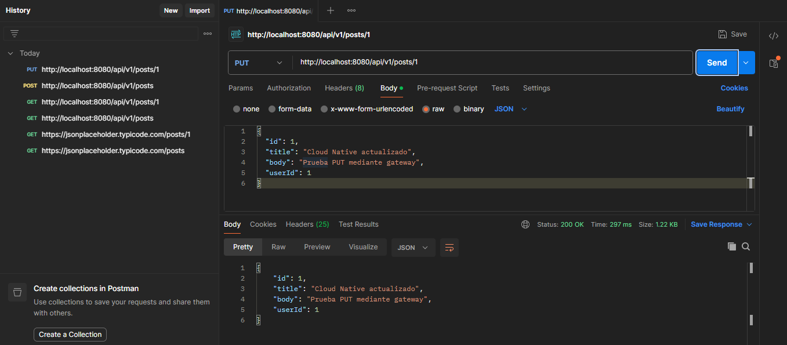


| DELETE | `/api/v1/posts/1` | 200 | | eliminación simulada |

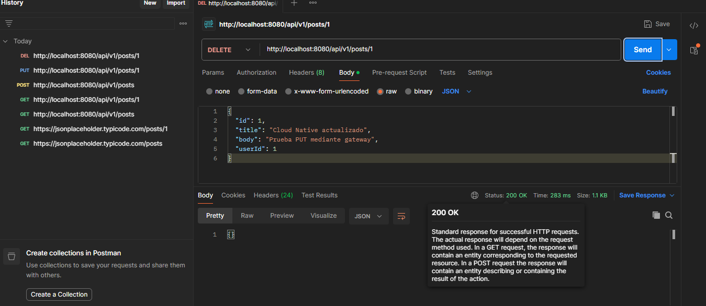

Para POST y PUT incluir también el body enviado.

---

## 4. Routing


- URL solicitada por el cliente: `http://localhost:8080/api/v1/posts/1`
- `id` de la route: `posts-v1`
- predicate que hizo match: `Path=/api/v1/posts/**`
- URI/integration configurada: `https://jsonplaceholder.typicode.com`
- path recibido finalmente por el backend: `/posts/1`
- función de `RewritePath`: eliminar el prefijo público `/api/v1/` antes de reenviar la solicitud al backend. En este caso transforma `/api/v1/posts/1` en `/posts/1`.

### Recorrido de una petición

Explicar con sus palabras:

```text
cliente → gateway → backend → gateway → cliente
```

```
El cliente le pide información al Gateway usando la dirección http://localhost:8080/api/v1/posts/1. 
El Gateway recibe la petición y revisa la dirección. Como esta coincide con la ruta de posts, sabe que debe enviarla al servicio correspondiente. 
Antes de enviarla, el Gateway cambia la dirección de /api/v1/posts/1 a /posts/1. Luego, manda esa petición a https://jsonplaceholder.typicode.com/posts/1. 
El servidor responde con la información solicitada. 
El Gateway recibe esa respuesta y se la entrega nuevamente al cliente.
En resumen: el cliente le pide la información al Gateway, el Gateway la busca en el servidor correspondiente y después le devuelve la respuesta al cliente.
```


---

## 5. Versionado

- Evidencia `/api/v1`: petición `GET http://localhost:8080/api/v1/posts/1` ejecutada correctamente.

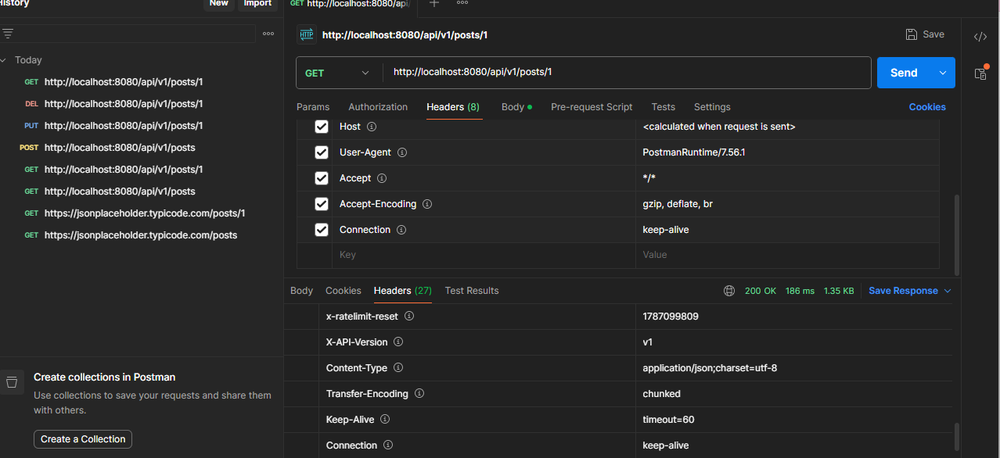

- Header `X-API-Version` observado: ``v1`

- Evidencia `/api/v2`: petición `GET http://localhost:8080/api/v2/posts/1` ejecutada correctamente.

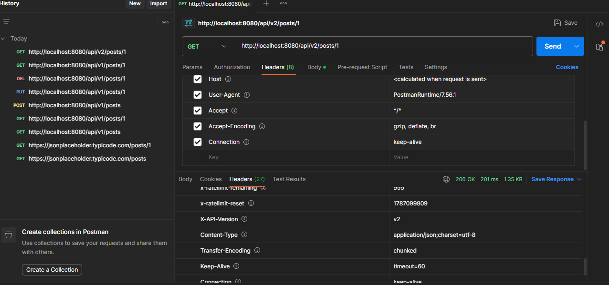

- Header `X-API-Version` observado: `v2`


Responder:

1. ¿Por qué mantener v1 y v2 simultáneamente?
Para permitir que los consumidores actuales continúen utilizando v1 mientras nuevos consumidores o aplicaciones pueden adoptar v2. Esto permite introducir cambios sin interrumpir inmediatamente a quienes dependen de la versión anterior.
2. ¿Qué consumidores podrían seguir usando v1?
Los clientes o aplicaciones que fueron desarrollados utilizando el contrato de v1 y que todavía no han sido actualizados para consumir v2.
3. ¿Cuándo retirarían una versión?
Una versión podría retirarse cuando sus consumidores hayan migrado a una versión más reciente y exista un proceso previamente comunicado para dejar de soportarla.
4. ¿Versionar el contrato público es lo mismo que versionar el servidor desplegado?
No. El versionado del contrato público define las rutas y comportamiento que se exponen a los consumidores, mientras que el versionado del servidor corresponde al software o despliegue que implementa esos servicios. En este laboratorio, v1 y v2 son contratos públicos diferentes aunque ambas rutas utilicen actualmente el mismo backend.

---

## 6. Header transversal

-Header v1
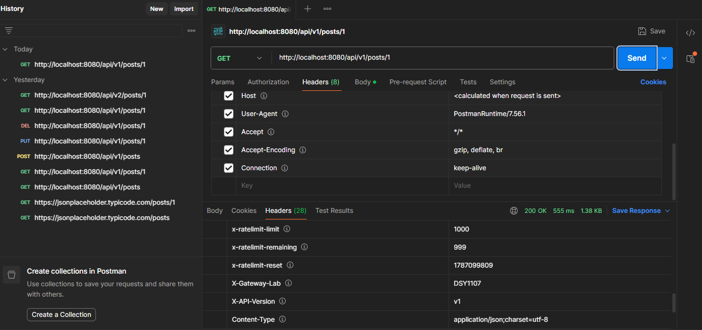

-Header v2
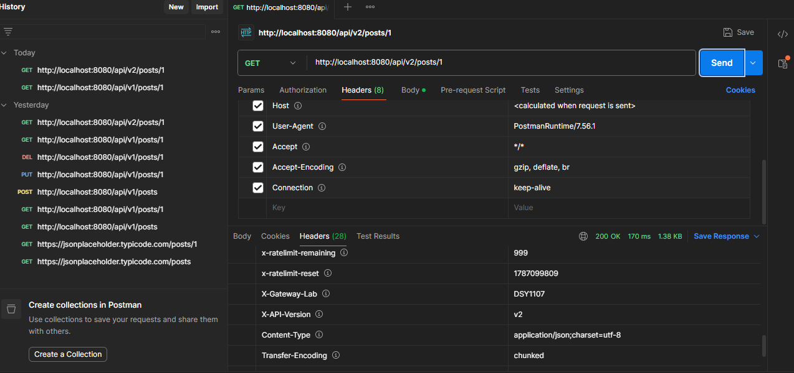

- Header esperado: `X-Gateway-Lab: DSY1107`
- Evidencia observada: las peticiones `GET /api/v1/posts/1` y `GET /api/v2/posts/1` devuelven el header `X-Gateway-Lab: DSY1107`.
- ¿Por qué este comportamiento puede considerarse transversal?:
Se considera transversal porque corresponde a un comportamiento del Gateway que se aplica de manera uniforme a las distintas rutas y no forma parte de la lógica de negocio del backend. En este laboratorio, tanto v1 como v2 incorporan el mismo header X-Gateway-Lab: DSY1107.

## Nota: 
Debido a que el starter usa Spring Cloud Gateway Server Web MVC, default-filters no se aplica como en WebFlux. Por ello, X-Gateway-Lab: DSY1107 se agregó explícitamente en ambas rutas para mantener el comportamiento transversal solicitado.


---

## 7. CORS

### Antes de configurar CORS

- URL del cliente web: `http://localhost:5500`
- Endpoint consultado: `http://localhost:8080/api/v1/posts/1`
- Resultado visible: La petición se realizó correctamente y el cliente mostró `HTTP 200` junto con el contenido JSON del recurso solicitado.
- Mensaje relevante en Console/Network: La petición no fue bloqueada por CORS. En los headers de respuesta se observó `Access-Control-Allow-Origin: http://localhost:5500`, aun cuando la configuración CORS local del Gateway se encontraba deshabilitada.

**Nota:** En esta prueba no se produjo el bloqueo esperado antes de habilitar CORS, ya que el backend JSONPlaceholder entrega headers CORS en sus respuestas y estos son reenviados por el Gateway.


### Después de configurar CORS

- Resultado visible:
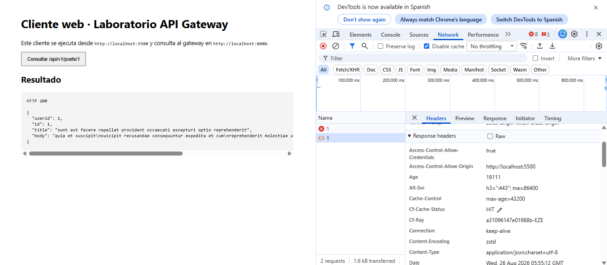
- Resultado visible: La petición se realizó correctamente y el cliente mostró `HTTP 200` junto con el contenido JSON del recurso solicitado.
- `Access-Control-Allow-Origin`: `http://localhost:5500`
- `Access-Control-Allow-Methods`: No se observa en la respuesta GET normal; se verificará mediante la solicitud preflight `OPTIONS`.
## Nota 3:
se detecta presencia de headers dublicados.

### Preflight OPTIONS

- Request utilizado: `OPTIONS http://localhost:8080/api/v1/posts`
- Status: `200`
- Headers relevantes:
  - `Access-Control-Allow-Origin: http://localhost:5500`
  - `Access-Control-Allow-Methods: GET,POST,PUT,DELETE,OPTIONS`
  - `Access-Control-Max-Age: 1800`

Responder:

1. ¿Por qué Postman puede funcionar cuando el navegador falla?
Postman puede realizar solicitudes porque no aplica la Same-Origin Policy de los navegadores. En cambio, el navegador controla las solicitudes entre orígenes diferentes mediante CORS y puede bloquear el acceso a la respuesta si los headers CORS no son válidos.
2. ¿Qué es un preflight?
Un preflight es una solicitud HTTP OPTIONS que el navegador puede realizar antes de la petición real para comprobar si el servidor permite el origen, el método HTTP y los headers que se desean utilizar.
3. ¿CORS autentica o autoriza usuarios?
No. CORS no autentica usuarios ni determina qué permisos tienen. Su función es controlar desde qué orígenes web el navegador permite acceder a un recurso.
4. ¿Qué riesgo tendría permitir cualquier origen sin analizar el contexto?
Permitir cualquier origen podría permitir que aplicaciones web no previstas consuman la API desde un navegador. Por esta razón, los orígenes permitidos deben definirse de acuerdo con los clientes que realmente necesitan acceder al servicio.

---

## 8. Richardson Maturity Model nivel 2

El laboratorio permite afirmar que la API trabaja al menos en el nivel 2 del Richardson Maturity Model porque utiliza recursos identificables, métodos HTTP con significado y códigos de estado HTTP. La colección se representa mediante /api/v1/posts y un recurso individual mediante /api/v1/posts/1. Para interactuar con estos recursos se utilizan métodos como GET para consultar, POST para simular una creación, PUT para simular una actualización y DELETE para simular una eliminación. Además, cada operación devuelve un status HTTP que comunica el resultado de la petición.

---

## 9. Responsabilidades

| Responsabilidad            | Cliente | Gateway | Backend | Justificación                                                                                                                         |
| -------------------------- | :-----: | :-----: | :-----: | ------------------------------------------------------------------------------------------------------------------------------------- |
| routing                    |         |    X    |         | El Gateway decide a qué servicio o integración enviar cada solicitud según las rutas configuradas.                                    |
| lógica de negocio          |         |         |    X    | La lógica propia de la aplicación debe mantenerse en el backend y no en el Gateway.                                                   |
| autenticación/autorización |         |    X    |    X    | Puede centralizarse parcialmente en el Gateway, aunque el backend también puede validar permisos según la arquitectura.               |
| transformación de rutas    |         |    X    |         | El Gateway modifica el path mediante filtros como `RewritePath` antes de reenviar la solicitud.                                       |
| persistencia               |         |         |    X    | El almacenamiento y manejo de los datos corresponde al backend.                                                                       |
| rate limiting              |         |    X    |         | Es una política transversal que puede aplicarse en el Gateway para limitar solicitudes antes de que lleguen al backend.               |
| reglas de negocio          |         |         |    X    | Las decisiones propias del dominio y del funcionamiento de la aplicación corresponden al backend.                                     |
| observabilidad             |         |    X    |    X    | El Gateway puede registrar y observar el tráfico general, mientras que el backend puede generar métricas y logs propios del servicio. |

## Nota 2:
La tabla pide clasificar donde corresponde cada responsabilidad arquitectonicamente.

---


## 10. Problemas encontrados

1. Problema: El header transversal `X-Gateway-Lab` no se aplicaba utilizando `default-filters`.
   - causa: El starter utiliza Spring Cloud Gateway Server Web MVC y la configuración `default-filters` indicada para la variante WebFlux no se aplicaba de la misma manera.
   - solución: Se agregó `AddResponseHeader=X-Gateway-Lab, DSY1107` explícitamente en las rutas v1 y v2, manteniendo el mismo comportamiento en ambas.

2. Problema: Antes de habilitar CORS en el Gateway, la petición desde el navegador funcionaba igualmente.
   - causa: JSONPlaceholder ya enviaba headers CORS en sus respuestas y el Gateway los reenviaba al cliente.
   - solución: Se registró el comportamiento observado y se continuó con la configuración CORS del Gateway para analizar el resultado real del laboratorio.

3. Problema: Al habilitar CORS en el Gateway, el navegador comenzó a bloquear la petición con `TypeError: Failed to fetch`.
   - causa: Tanto JSONPlaceholder como el Gateway agregaban `Access-Control-Allow-Origin: http://localhost:5500`, produciendo el header duplicado y una respuesta CORS inválida para el navegador.
   - solución: Se agregó `RemoveRequestHeader=Origin` en las rutas del Gateway para evitar que el header `Origin` fuese reenviado a JSONPlaceholder. De esta manera, la política CORS quedó controlada por el Gateway y la respuesta pasó a contener un único `Access-Control-Allow-Origin`.

---

## 11. Colaboración GitHub

| Integrante | Rama | Pull Request | Aporte principal |
|---|---|---|---|
| | | | |

Agregar enlaces a los Pull Requests.

---

## 12. Conclusiones

## 12. Conclusiones

- ¿Qué problema resolvió el gateway?

El API Gateway permitió entregar un punto de entrada común para los clientes, evitando que estos tuvieran que conocer directamente la ubicación del backend. Además, permitió centralizar aspectos como el routing, la transformación de rutas, el versionado de la API, la incorporación de headers y la configuración CORS.

- ¿Qué concepto del laboratorio sería equivalente al trabajar posteriormente con Amazon API Gateway?

El concepto equivalente sería utilizar Amazon API Gateway como punto de entrada para definir rutas y métodos HTTP, conectar esas rutas con servicios backend y aplicar políticas transversales sobre las solicitudes y respuestas.

- ¿Qué aprendió el grupo que no depende específicamente de Spring Cloud Gateway?

Se aprendió que conceptos como routing, versionado de APIs, métodos y status HTTP, CORS, separación de responsabilidades y uso de un Gateway como intermediario son principios de arquitectura de APIs que pueden aplicarse independientemente de la tecnología utilizada para implementarlos.


